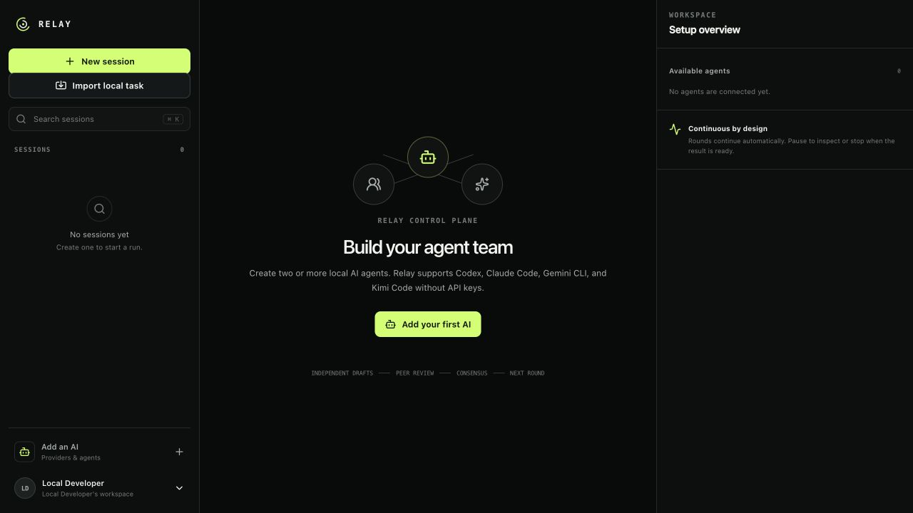
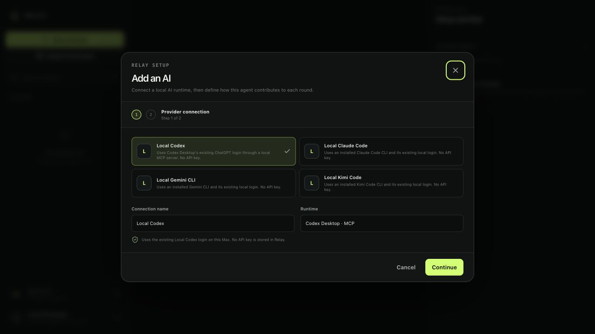
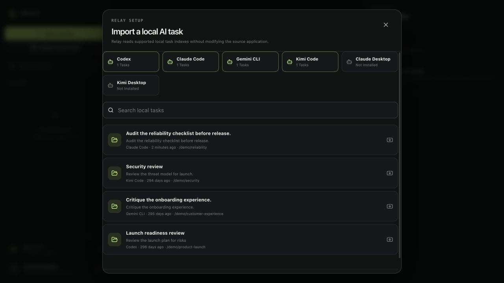
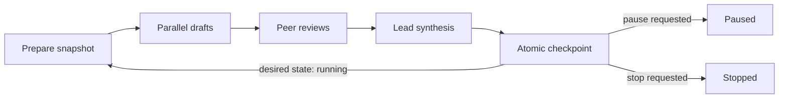

# Relay

Relay is a local-first multi-agent orchestration workspace for macOS. It connects to supported AI command-line tools through their existing local logins, discovers supported task histories in read-only mode, and runs durable rounds of drafting, peer review, and synthesis until the agents agree or the operator pauses or stops the run.



## Local AI support



| Local AI | Run new reviews | Import existing tasks | Authentication |
| --- | --- | --- | --- |
| Codex | Codex MCP server | Codex local task index | Existing ChatGPT login |
| Claude Code | Claude Code CLI | Claude Code project transcripts | Existing Claude login |
| Gemini CLI | Gemini CLI | Gemini CLI session files | Existing Google login |
| Kimi Code | Kimi Code CLI | Kimi Code session files | Existing Kimi login |
| Custom local CLI | Explicit local command | — | Existing local login or runtime |

Claude Desktop and Kimi Desktop are detected when present, but Relay does not scrape their private browser/cache storage. Install the corresponding supported CLI to run those AIs. Grok and other services can be added through the optional API adapters when a stable local headless runtime is not available.



## What is included

- Multiple concurrent sessions with independent goals and agent rosters
- Reusable Codex, Claude Code, Gemini CLI, Kimi Code, and trusted custom local CLI connections and agent profiles
- Read-only discovery and bounded transcript import for supported local task formats, without displaying or copying source workspace paths
- Per-agent model selection and minimal, low, medium, high, or extra-high thinking levels
- A Relay MCP server for creating and controlling sessions from Codex Desktop
- Optional OpenAI Responses and OpenAI-compatible Chat Completions adapters
- All-to-all and round-robin peer-review topologies
- Continuous, checkpointed rounds with no iteration limit by default
- Durable pause, resume, graceful stop, and immediate stop commands
- PostgreSQL-backed jobs, artifacts, events, usage, and execution fencing
- Replayable server-sent events for live UI updates
- OIDC production authentication and a localhost-only development identity
- No API credential for the local Codex path
- Write-only, envelope-encrypted credentials for optional remote providers
- Production allowlists for custom provider hosts
- Responsive, keyboard-accessible operator console

## Round lifecycle



“Continuous” means that Relay schedules one finite, recoverable round at a time. It does not depend on a browser tab, recursive request, or immortal in-memory loop.

## Run the Mac desktop app

The packaged app contains the Relay web server, worker, and embedded PostgreSQL-compatible PGlite database. It binds only to loopback, generates its own runtime secrets, and stores its database under the current macOS user profile. Docker, API keys, and a separately managed database are not required for local mode.

Requirements for building from source:

- macOS 12 or newer
- Node.js 22 or newer and pnpm 11.9
- At least one supported local AI CLI, installed and signed in

```bash
pnpm install
pnpm verify
pnpm desktop:package
open release/mac-universal/Relay.app
```

The universal package contains both Apple Silicon and Intel executables. Public distribution without Gatekeeper warnings additionally requires an Apple Developer ID Application certificate and notarization credentials; electron-builder picks those up from the standard signing environment.

## Web/server development setup

Requirements:

- A supported local AI CLI, signed in
- Node.js 22 or newer and pnpm 11.9
- Docker Desktop or another Docker-compatible runtime for the external PostgreSQL profile

Create the environment file and replace the secret placeholders:

```bash
cp .env.example .env
openssl rand -hex 32
openssl rand -base64 32
```

Install dependencies, create the isolated AI runtime directory configured by `RELAY_LOCAL_AI_CWD`, and start the database and web app:

```bash
pnpm install
mkdir -p /absolute/path/to/an/empty/relay-runtime
docker compose up --build -d postgres migrate web
```

Run the local worker on the host in a second terminal. It launches the configured local AI runtimes with their existing logins:

```bash
pnpm worker:local
```

Open `http://localhost:3000`.

### Link Codex Desktop

Register Relay as a Codex MCP server once, using absolute paths:

```bash
codex mcp add relay \
  --env RELAY_ENV_FILE=/absolute/path/to/multiagent/.env \
  --env RELAY_WORKSPACE_ID=your-workspace-uuid \
  -- /absolute/path/to/multiagent/scripts/relay-mcp
```

Restart Codex Desktop or open a new task after registration. Codex can then use `relay_status`, `relay_create_session`, `relay_get_session`, pause/resume/stop controls, and queued operator instructions. Run `codex mcp get relay` to inspect the registration.

`AUTH_MODE=development` creates a local owner identity so the application can be evaluated without an identity provider. Production builds require `ALLOW_LOCAL_DEVELOPMENT_AUTH=true`, a loopback `APP_URL`, and the loopback-only Compose port binding. Hosted deployments must use OIDC.

## Docker Compose

After filling `.env`, run:

```bash
docker compose up --build -d postgres migrate web
pnpm worker:local
```

Migrations finish before the web service starts. The local Codex worker intentionally runs on the host so it can use the signed-in Codex installation; the optional `remote-api` Compose profile runs the API-backed worker instead. This is a hardened single-host baseline, not a claim of audited hosted production readiness. Hosted deployments still need managed PostgreSQL, independent replicas, TLS, centralized redacted logs, monitoring, and tested backups.

## Production authentication

Set:

```dotenv
AUTH_MODE=oidc
OIDC_ISSUER=https://identity.example.com
OIDC_CLIENT_ID=relay
OIDC_CLIENT_SECRET=...
OIDC_SCOPES=openid profile email
APP_URL=https://relay.example.com
```

The OIDC client must allow `https://relay.example.com/api/auth/callback` as a redirect URI. Provider credentials, membership changes, and run controls are server-authorized; no upstream API key is returned to the browser after creation.

## Providers

Relay includes presets for:

| Provider | Default origin | Protocol |
| --- | --- | --- |
| Local Codex | `local://codex` | Codex MCP over stdio |
| Local Claude Code | `local://claude` | Claude Code CLI |
| Local Gemini CLI | `local://gemini` | Gemini CLI |
| Local Kimi Code | `local://kimi` | Kimi Code CLI |
| OpenAI / Codex | `https://api.openai.com/v1` | Responses |
| xAI / Grok | `https://api.x.ai/v1` | Responses |
| Moonshot / Kimi | `https://api.moonshot.ai/v1` | Chat Completions |
| Custom | Operator allowlist | Responses or Chat Completions |

Local reviews run in a dedicated empty Relay runtime directory rather than a source tree or home directory. Codex, Claude Code, and Gemini are invoked in non-mutating/plan modes. Kimi's non-interactive CLI does not combine its prompt and plan flags, so Relay isolates its working directory, disables Kimi telemetry, and instructs it to review without modifying files. The database remains the source of truth, so worker or app restarts preserve Relay history.

For an AI CLI Relay does not yet recognize, choose **Custom local CLI** while adding an AI. Relay requires the executable’s absolute path, accepts arguments one per line, and invokes the exact command without a shell. Prompts are supplied through standard input unless an argument contains `{prompt}`. This is intended for local commands you trust; Relay still uses its dedicated empty runtime directory and keeps the command configuration encrypted at rest.

Model IDs stay editable because installed runtime versions and account access vary. Relay maps each agent's thinking level to Codex reasoning effort, `CLAUDE_CODE_EFFORT_LEVEL`, or `KIMI_MODEL_THINKING_EFFORT`; Gemini uses the selected model's supported reasoning behavior.

In production, custom origins must appear in `CUSTOM_PROVIDER_HOSTS`. Arbitrary private, loopback, metadata, credential-bearing, redirecting, or non-HTTPS destinations are rejected. A hosted Relay instance intentionally cannot call a user’s localhost; local models should be exposed through a separately secured outbound runner or approved gateway.

## Control semantics

- **Pause** records intent immediately, dispatches no new work, and settles at the next safe checkpoint.
- **Resume** continues only missing work from a paused round.
- **Graceful stop** lets already-dispatched requests settle, checkpoints accepted results, and ends the run.
- **Immediate stop** aborts cancellable requests and increments the execution epoch. Late results from the previous epoch are discarded.
- **Restart** clones a stopped session into a new run. Stopped runs never resume.

Agent additions, removals, and prompt changes take effect at the next round boundary so an in-flight round remains reproducible.

## Verification

```bash
pnpm lint
pnpm typecheck
pnpm test
pnpm build
```

Or run the complete gate:

```bash
pnpm verify
```

## Repository map

```text
db/                     PostgreSQL migrations
scripts/                migration and operational entry points
src/app/                Next.js pages and HTTP/SSE routes
src/components/         operator UI
src/lib/                shared contracts and provider presets
src/orchestration/      prompts, provider adapters, state machine, repository
src/server/             auth, tenant context, encryption, API services
src/worker/             durable round worker
```

See [architecture](docs/architecture.md) and [security policy](SECURITY.md) for deployment invariants.
